# 최성원의 신의 한 큐 5회 - 야스퍼스 따라잡기(더블레일)

Last Updated: 2016-01-18

## 딕 야스퍼스의 더블레일

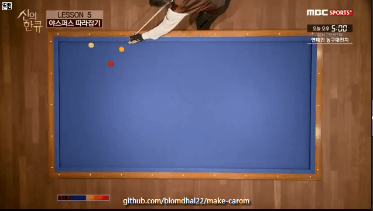

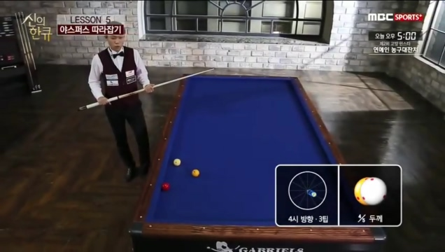
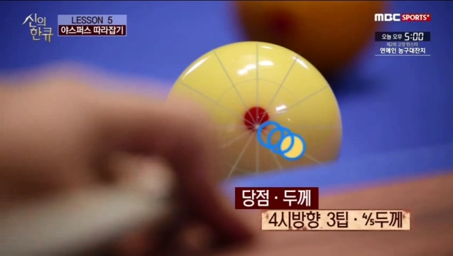

**당점 / 두께 / 스트록 : 4시 3팁 / 4/5두께 / 부드럽게 임팩트를 확실히**

---

## 응용 1

**더블 레일은 한계각을 이해하는 것이 가장 중요**

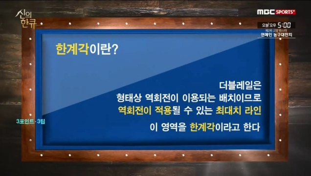

#### 한계각 0팁

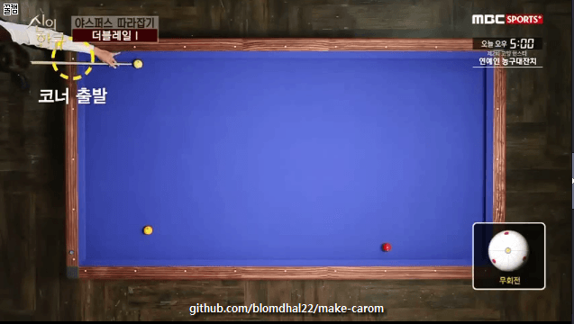

#### 한계각 1팁

#### 한게각 2팁

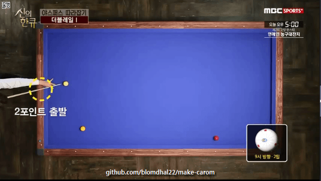

#### 한계각 3팁

#### 한계각을 넘어갔을 경우

#### 한계각 정리

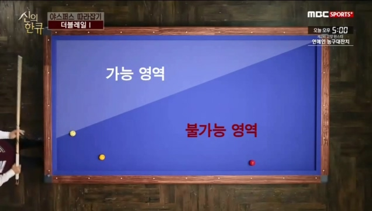

> 가능 영역에서는 팁조정으로 조절이 가능하다.

### 수구의 출발 지점을 아는 법

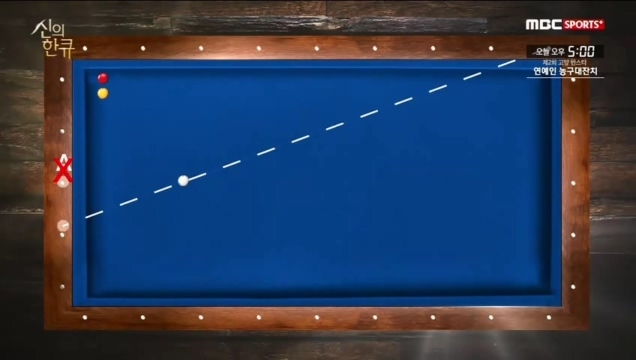

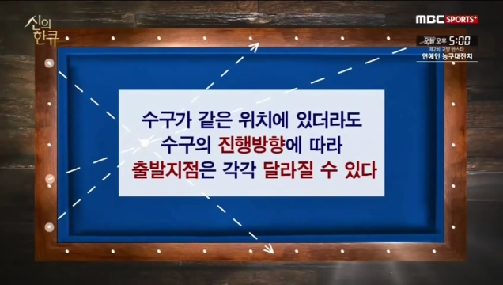

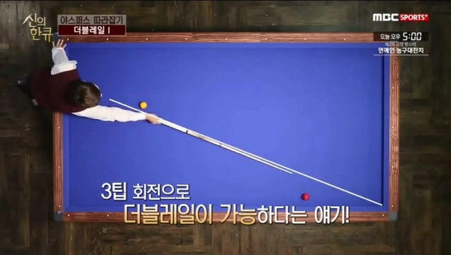

한계각 안에 있다는 것이 확인 된다.

> 수구의 스피드가 너무 빠르면 회전 작용이될 여유가 없다.
> 그러므로, 스피드를 너무 강하게 치지 말것.

**당점 / 두께 / 스트록 : 3시 3팁 / 3/5두께 / 너무 빠르지 않게**

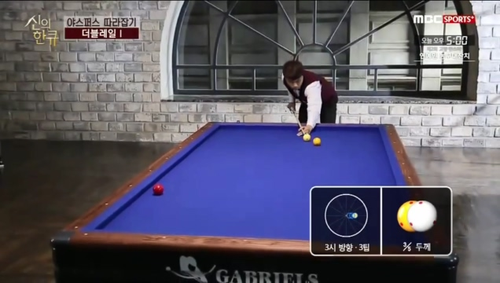

#### 유의점

1. 수구가 변화 없이 코너로 진행될 수 있는 스트로크
2. 회전이 적절하게 이용될 수 있는 수구의 스피드

### 핵심 정리

1. 더블레일은 3포인트 라인이 한계각이다.
2. 내 수구의 출발지점을 정확히 찾는 것이 중요하다.
3. 수구의 스피드가 너무 빠르면 회전이 제대로 작용되지 않는 점을 유의

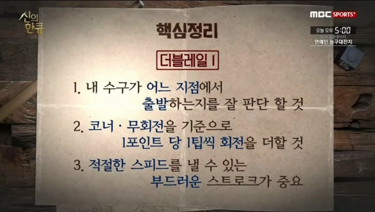

---

## 응용2 

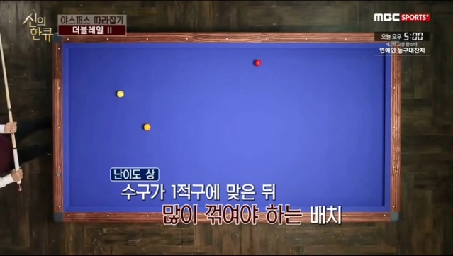

수구가 1적구에 맞은 뒤 많으 꺽어야 하는 배치이다.
**=> 그래서 성공 시키지 위해서는 회전력을 최대한 사용해야 한다.**

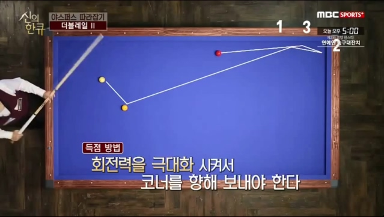

**회전력을 최대한 살리기 위해서는?**

> 두껍께 쳐야 한다.
> 얇으면, 회전이 빨리 풀린다.

### 두께와 회전력의 관계

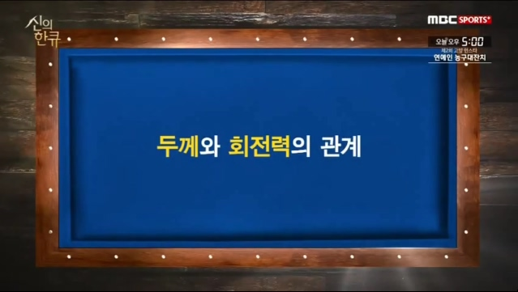

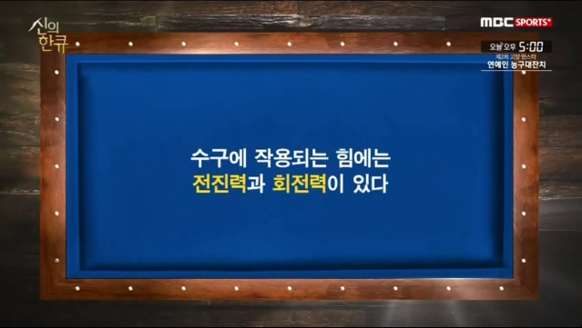

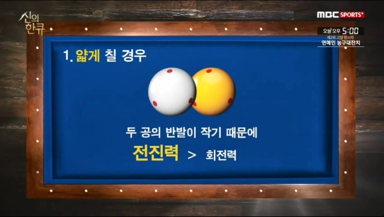

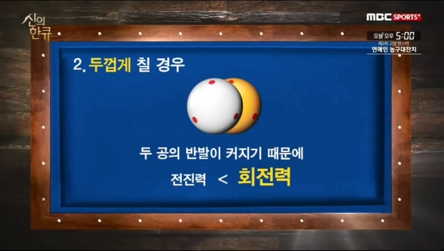

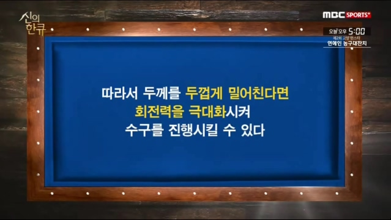

### 끌어치기 - 최성원의 TIP

끌어쳐야하니깐, 끌기위해서 불필요한 동작을 하는 경우가 있다.

> 중요: 당점은 아래에 주고, 스트로크는 밀어치는 느낌으로만 치면 된다.
> 당점에 의해서 자연스럽게 끌리게 된다.

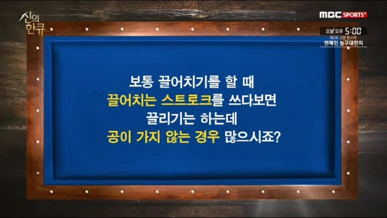

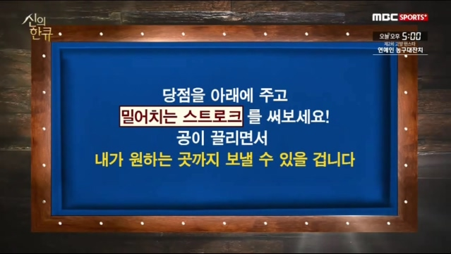

### 해결

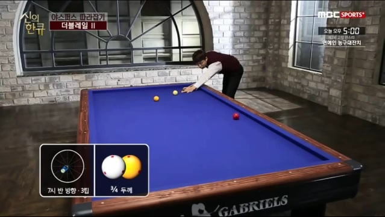

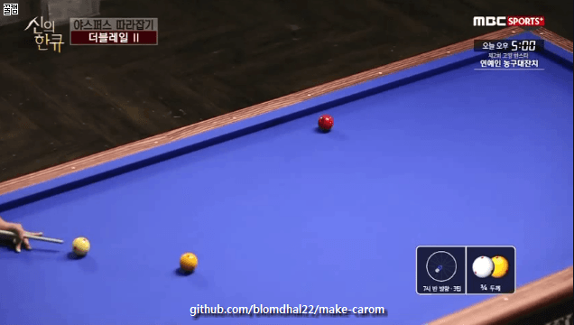

**당점 / 두께 / 스트록 : 7시 3팁 / 3/5두께 / 당점을 아래에 주고, 밀어친다.**

**요점**

1. 끌어치기를 할 때, 억지로 끌려고 하지 말 것.
2. 당점은 확실히 아래로 줄 것.
3. 스트로크는 밀어치는 느낌.

### 요약 정리

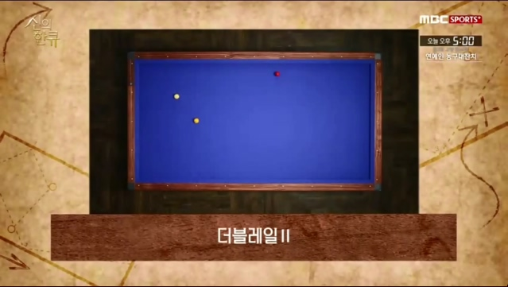
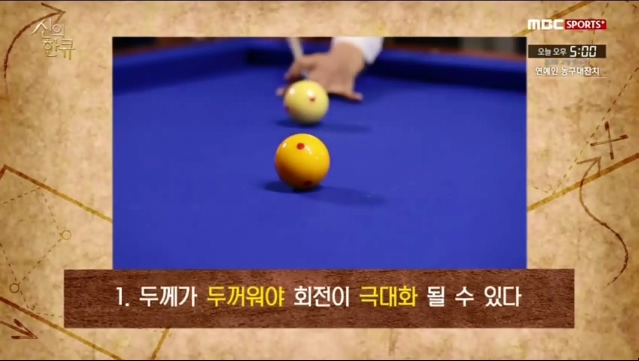
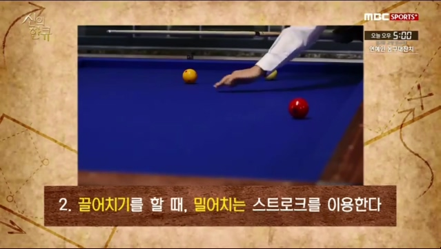

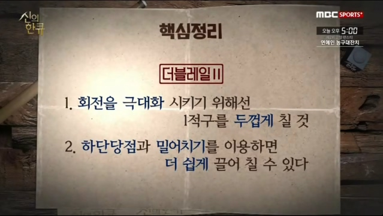

