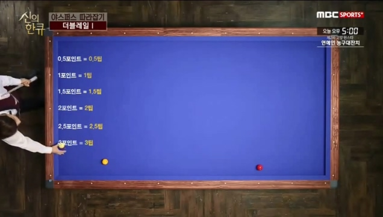

# 최성원의 신의 한 큐 5회 - 야스퍼스 따라잡기(더블레일)

## 딕 야스퍼스의 더블레일

**당점 / 두께 / 스트록 : 4시 3팁 / 4/5두께 / 부드럽게 임팩트를 확실히**

---

## 응용 1

**더블 레일은 한계각을 이해하는 것이 가장 중요**

#### 한계각 0팁

#### 한계각 1팁

#### 한게각 2팁

#### 한계각 3팁

#### 한계각을 넘어갔을 경우

#### 한계각 정리

> 가능 영역에서는 팁조정으로 조절이 가능하다.

### 수구의 출발 지점을 아는 법

한계각 안에 있다는 것이 확인 된다.

> 수구의 스피드가 너무 빠르면 회전 작용이될 여유가 없다.
> 그러므로, 스피드를 너무 강하게 치지 말것.

**당점 / 두께 / 스트록 : 3시 3팁 / 3/5두께 / 너무 빠르지 않게**

#### 유의점

1. 수구가 변화 없이 코너로 진행될 수 있는 스트로크
2. 회전이 적절하게 이용될 수 있는 수구의 스피드
3. 

### 핵심 정리

1. 더블레일은 3포인트 라인이 한계각이다.
2. 내 수구의 출발지점을 정확히 찾는 것이 중요하다.
3. 수구의 스피드가 너무 빠르면 회전이 제대로 작용되지 않는 점을 유의

---

## 응용2 

