# The Lesson 27-28 - Choi Sung Won

## Contents

* 27th 난구 풀이
    * 난구풀이1
    * 난구풀이2
    * 난구풀이3
    * 난구풀이4
* 28th 키스빼기
    * 포지션1
    * 포지션2

전체동영상: 이미지 클릭

[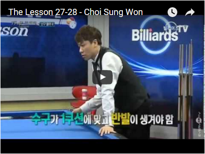](https://youtu.be/3q6FHg-lJWM)

## 27th 난구 풀이

### 포지션1

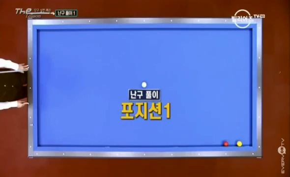

> 회전력이 많고 강하게 치면 실패확률이 높다.
> 부드럽게 밀어치는 스트록으로 공략
> 코너에서 반팁 정도의 회전력이 작용하도록 플레이

**당점 / 두께 : 1시 3팁 / 1**

### 포지션2

선택할 공이 마땅지 않음

1. 빈쿠션 : 2적국가 맞을 확률 낮음
2. 제각돌리기 : 키스 위험

**당점 / 두께 : 5시 3팁 / 1, 간결한 스트록으로 강하게 끌어치기**

> 하단 당점을 통해서, 전진력을 살려준다.

### 포지션3

양쪽에 쿠션이 붙어 있어서, 어렵다.

1. 제각돌리기는 키스
2. 빨간공은 자세가 나오지 않는다.

그래서 역회전을 이용해서 공격한다.

> 한계각 설정, 코너를 돌아 2적구를 맞힐 수 있는 회전력을 알아야 함.
> 1, 1.5, 2포인트까지 한계각을 알아야 한다.
> 더블레일의 한계각은 1.5포인트이다.
> 스트록은 부드럽게 밀어치면, 수구가 휘어지는 현상 발생
> 그러므로, 중하단의 MAX를 이용해서 빠른 스트록으로 플레이

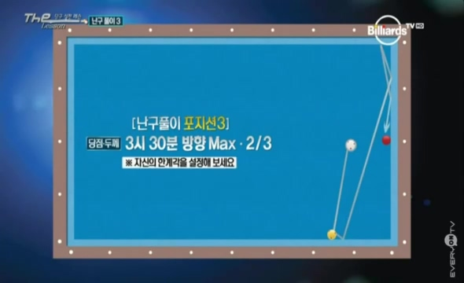

### 포지션4

역회전을 활용한 길게 세워치키가 가능한 위치

**당점 / 두께 : 8시 3팁 / 1/3, 1적구를 통과하는 느낌으로 친다.**

> 수구가 1쿠션에 맞고 반발이 생겨야 함.
> 스트록은 follow throw를 끝까지 넣어주어야 한다.
> 상단력이 적용되면, 휘어지는 라운드 현상이 발생하고, 각도 형성이 되지 않음.

## 28th 키스 피하기

### 키스피하기1

**키스를 피하기 위해서는 1적구의 진로가 핵심 포인트이다.**

아주 편안한 위치다. 그러나, 편하게 치면 키스가 발생한다.

그래서, 두껍게 공략한다.
그러나, 이 때, 스트록이 타격이 들어간 밀어치기가 된다면, 1적구가 2적구를 때리는 현상이 발생할 수 있다.

두껍께는 치되, 아주 편한하게 팔로스루만 넣어주면 1적구의 진로를 바꾸는 현상이 생긴다.

**당점 / 두께 : 10반 3팁 / 2/3 / 편안한 스트록으로 무리업이 팔로 스루**

### 키스피하기2

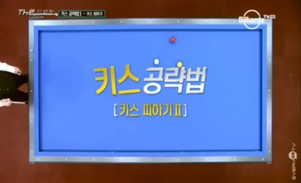

편안하게 친다면, 키스가 발생한다.

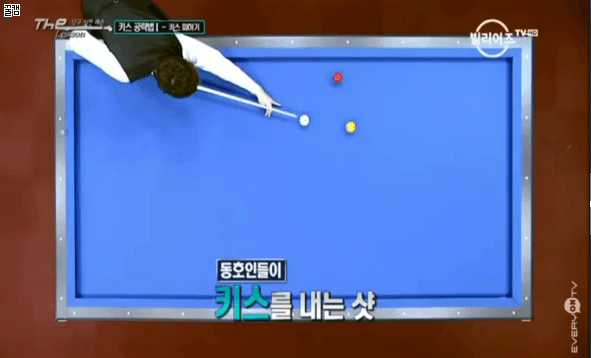

그래서 두껍게 친다면, 1적구와 2적구 키스가 발생

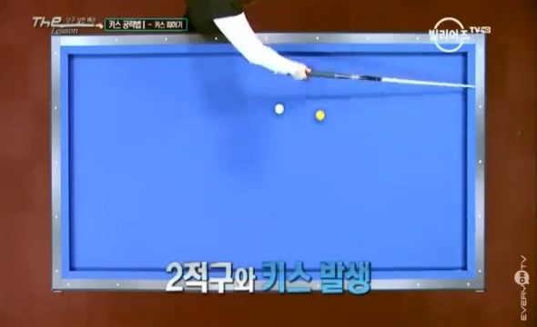

그래서 1적구룰 얇게 맞힌다. 그래서 적구끼리의 키스는 피할 수 있다.

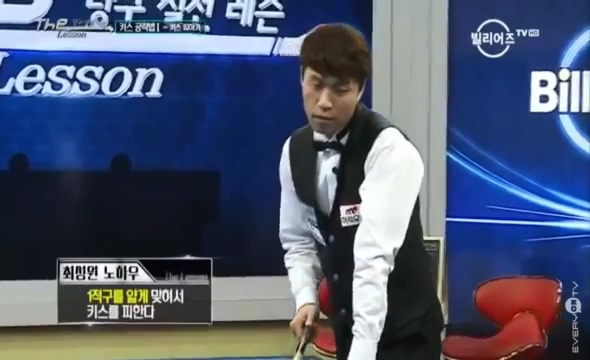

그러나, 그럼에도 불구하고 교차를 피할 수는 없다.

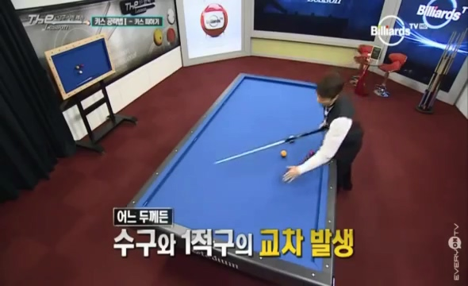

> 그래서, 수구를 느리게 보내서, 시간차를 이용해서 키스를 피한다.

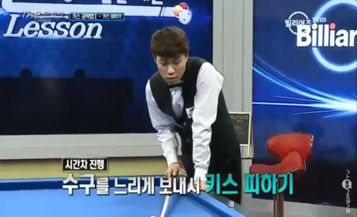

**살짝 끌어쳐서 1적구를 먼저 보낸 후 수구를 느리게 이동시킨다.**

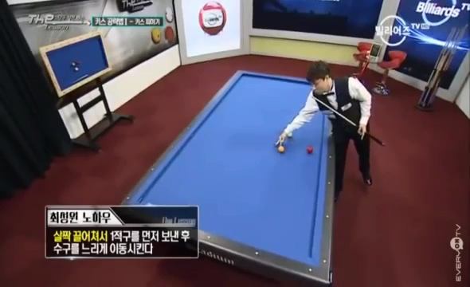

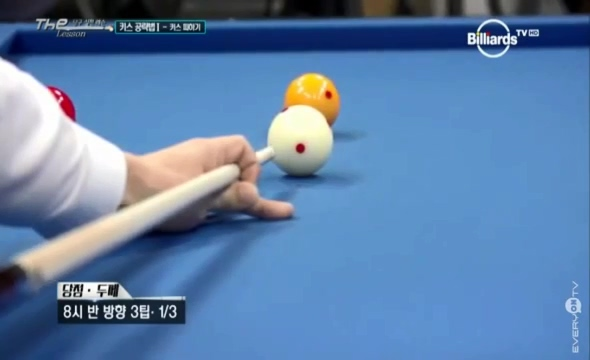
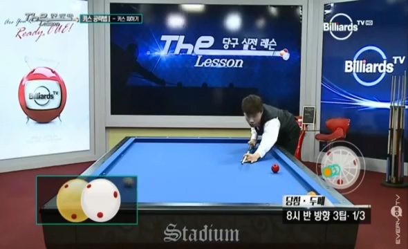

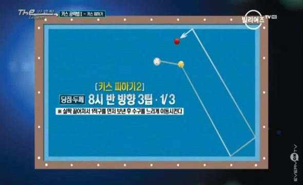

**당점 / 두께 / 스트록 : 8시 반 3팁 / 1/3 / 살짝 끌어서 적구를 먼저 보낸 후 수구를 느리게 **

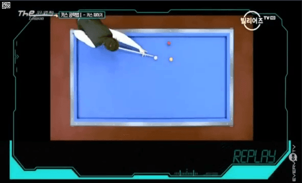

