# The Lesson - 34th Blomdahl Outside Angle Shot

Last Update: 2016-01-11

## Contents

* 34th Blomdahl Outside Angle Shot
    * 포지션1
    * 포지션2
    * 포지션3
    * 포지션4
    * 포지션5

전체동영상: 이미지 클릭

[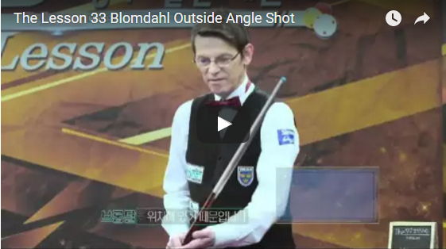](https://youtu.be/9jopAL5sSWo)

## Blomdahl Outside Angle Shot

### 포지션1

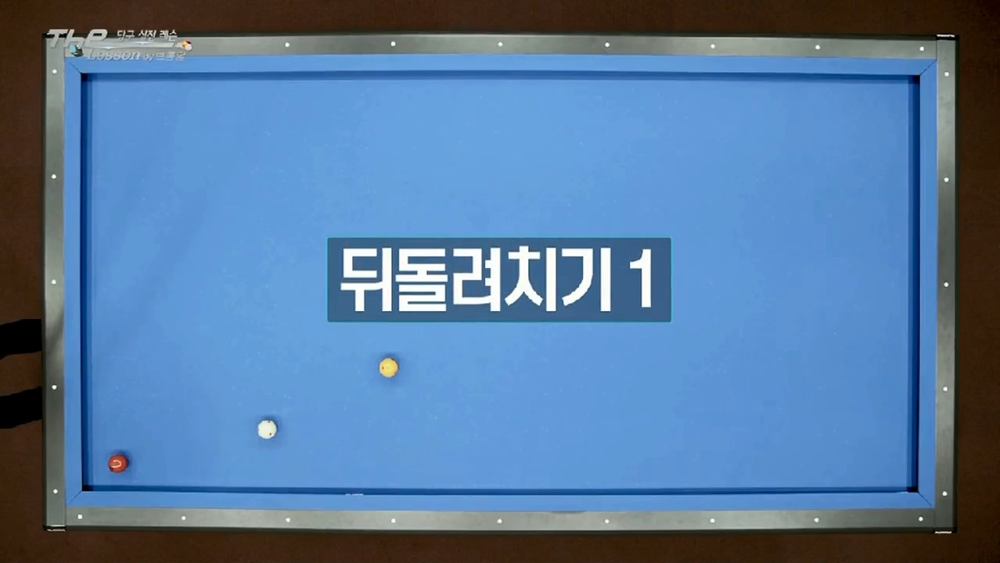

**당점 / 두께 / 스트록 :  '7시 3팁 / 1/4 / 빠르게 밀어치기'**

> NOTE: 1/2로치면 키스 발생

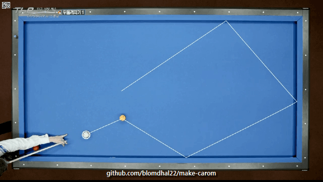

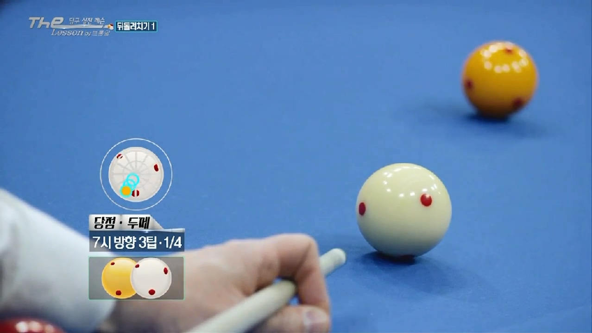

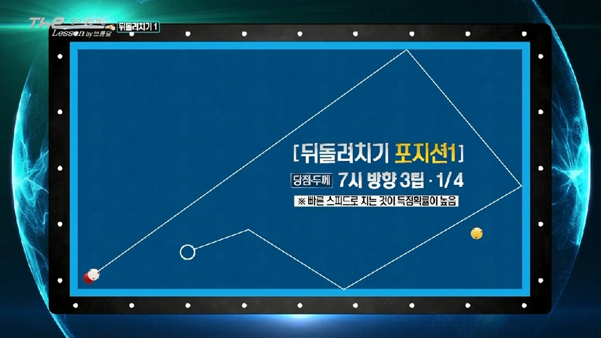

### 포지션2

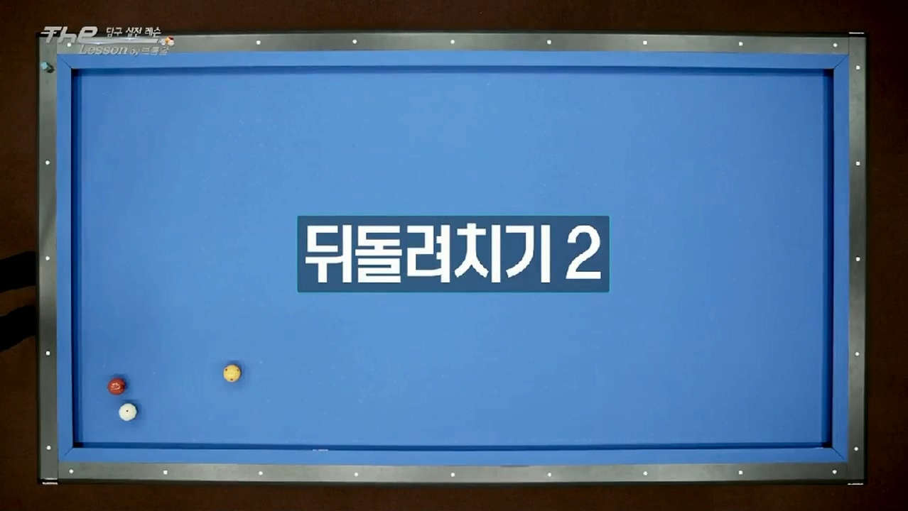

> NOTE: 길게 떨여지면 확률이 낮다. 그렇기 때문에 짧게 떨어뜨려야 한다.

**당점 / 두께 / 스트록 :  '7시반 3팁 / 1/4 / 빠르게 밀어치기'**

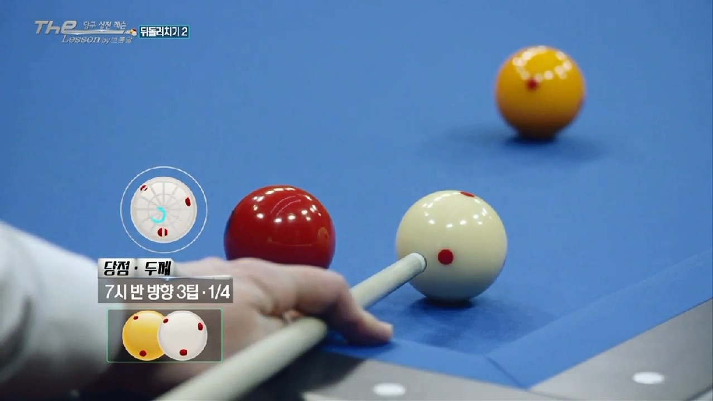

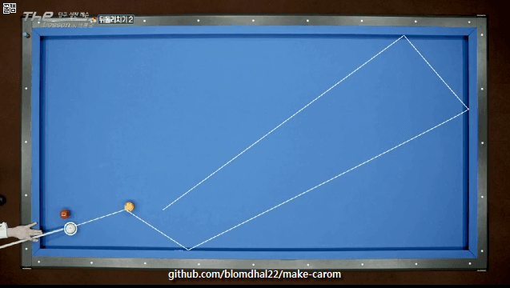

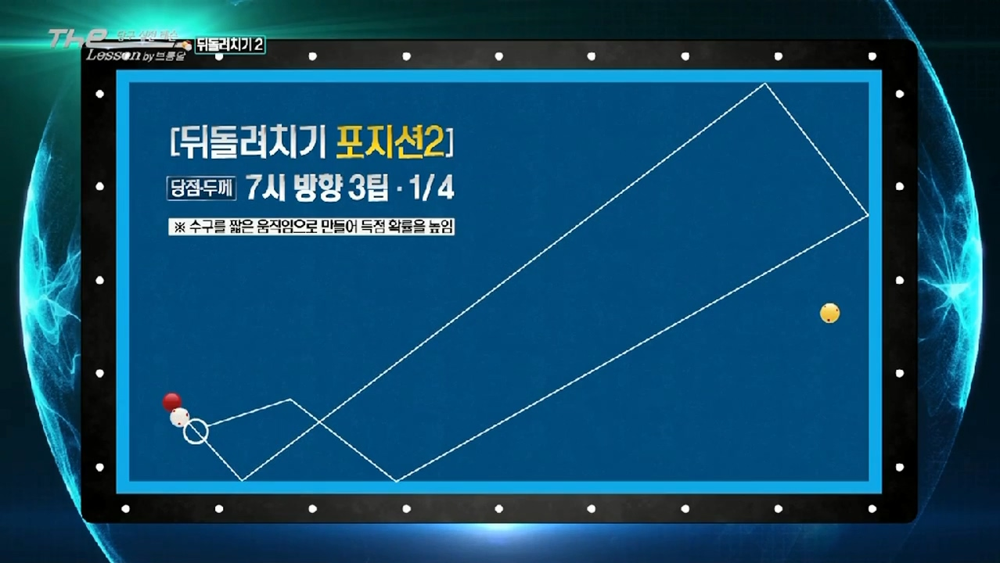

### 포지션3

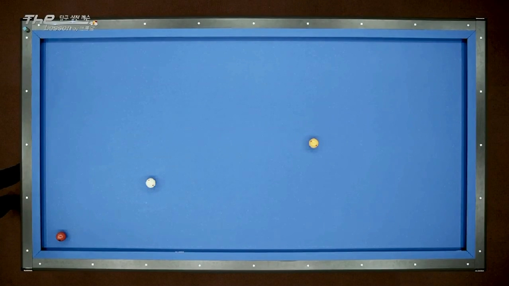

> 끌어치기를 이용하지만, 완전히 끄는 것이 아니라, 끌리는 성질을 이용한다.

> 너무 얇게 치면, 2쿠션 이후에 키스
> 너무 두꺼우면 1,2,3,4,5 쿠션 이후에 키스 발생 가능
> 그래서 절반 두께 사용

**당점 / 두께 / 스트록 :  '8시 2팁 / 1/2 / 부드럽게 끌어치기'**

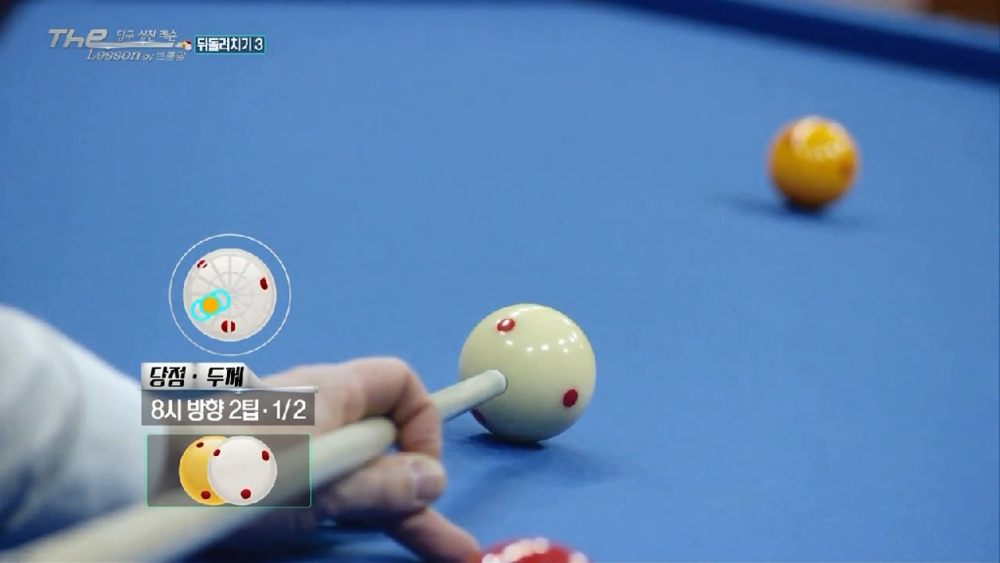

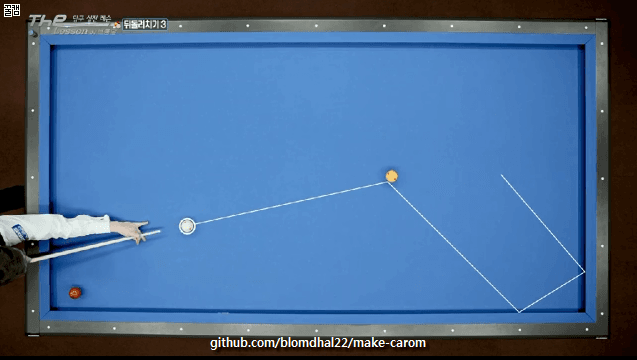

*잘못된 예:*

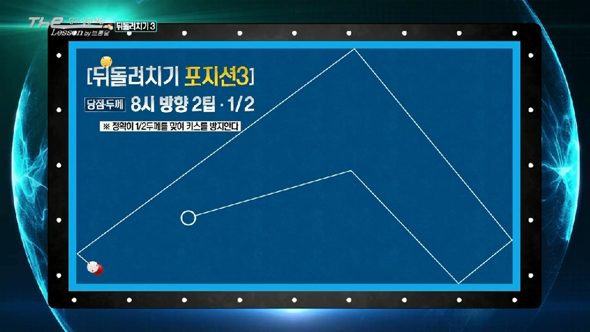

### 포지션4

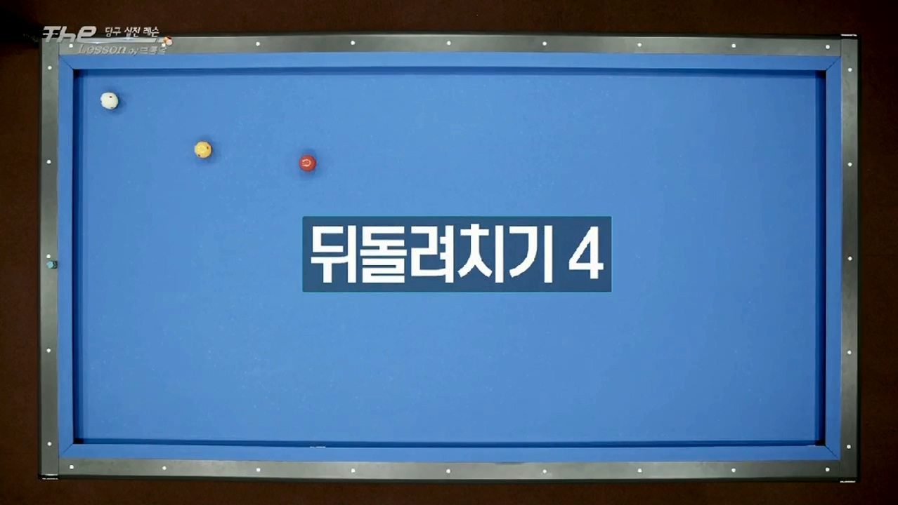

이전것보다 어려운데 빨간공이 떠있기 때문이다.

> 길게 치고, 속도를 좀 더 내서 치자. 빠르게 밀어치자 그게 쉽다고 생각한다.

**당점 / 두께 / 스트록 :  '4시반 2팁 / 1/2 / 부드럽게 밀어치기'**

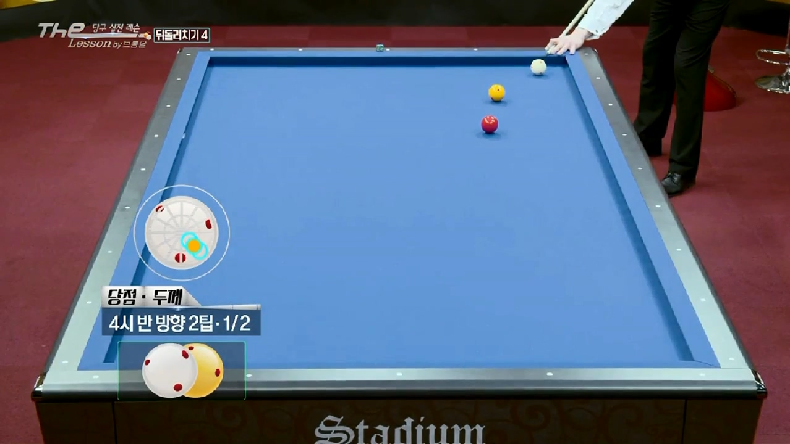

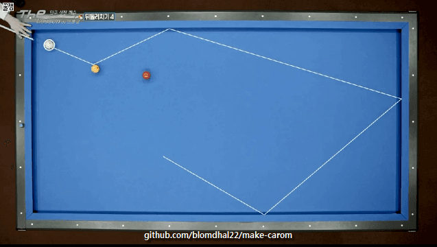

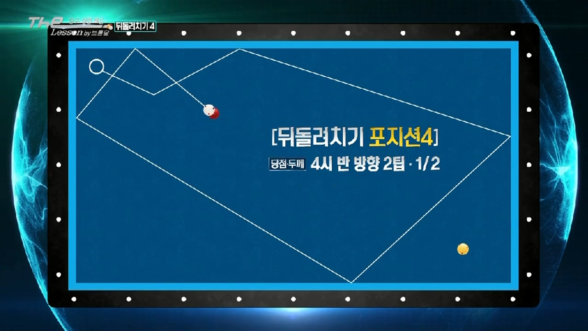

### 포지션5

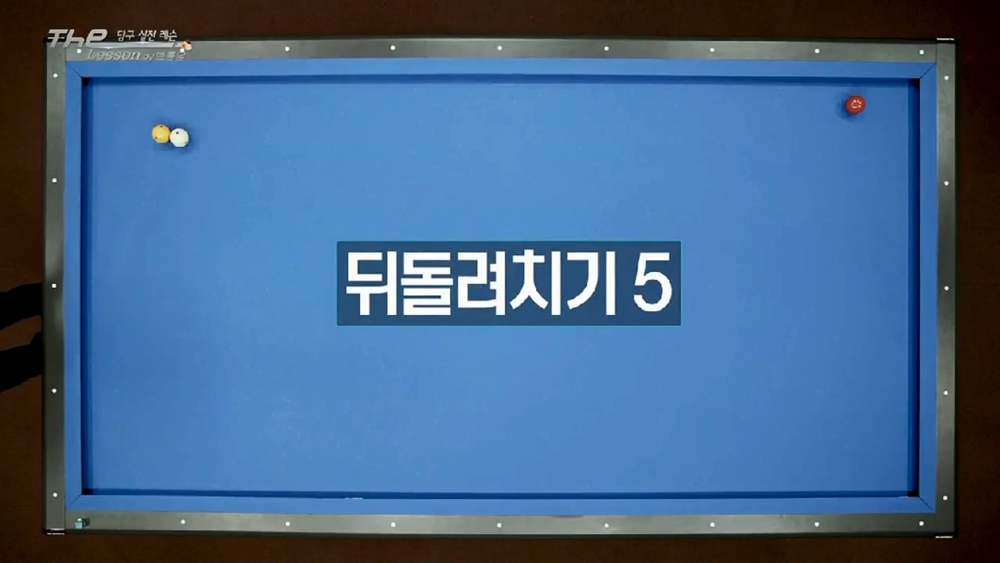

마세이를 이용한 샷, 가볍게 찍어치기 

**당점 / 두께 / 스트록 :  '윗면 9시 3팁 / 1/4 / 가볍게 찍어치기'**

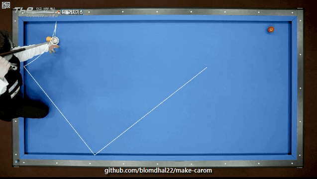

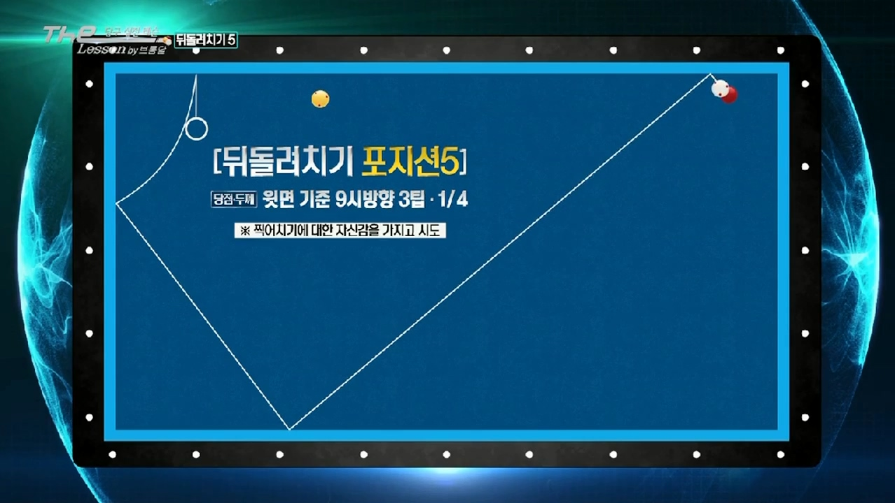