# The Lesson - 34th Blomdahl Short Angle Shot

Last Update: 2016-01-12

## Contents

* 34th Blomdahl Short Angle Shot
    * 포지션1
    * 포지션2
    * 포지션3
    * 포지션4
    * 포지션5

전체동영상: 이미지 클릭

[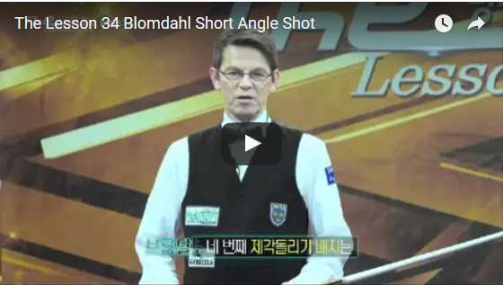](https://youtu.be/viUf51kvkBI)

## Blomdahl Short Angle Shot

### 제각돌리기1

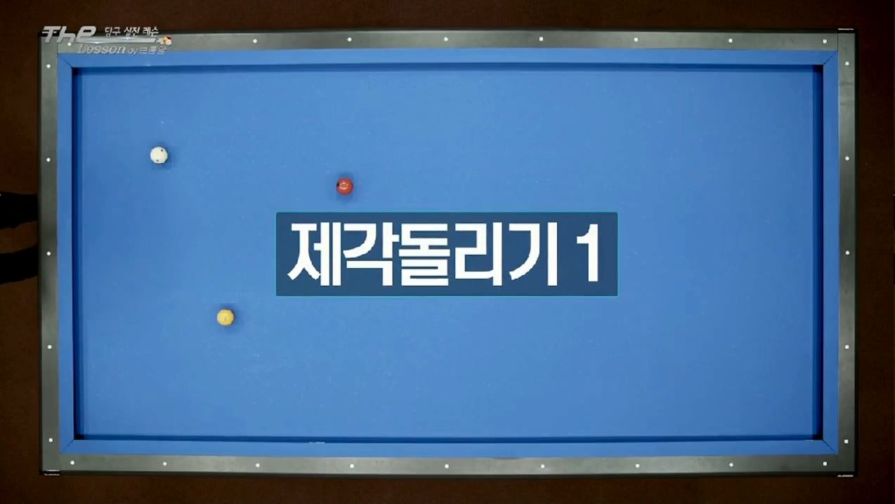

**당점 / 두께 / 스트록 : '3시 3팁 / 4/5 / 부드럽게 밀어치기'**

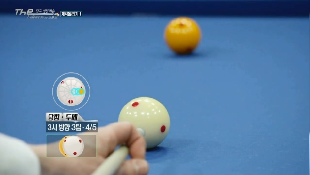

> 성공 후 포지션으로 연결된다.
> 4/5를 쳐서 훅현상을 이용한다.

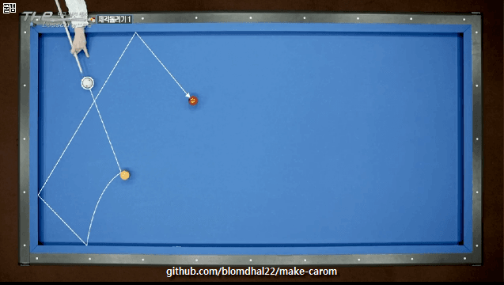

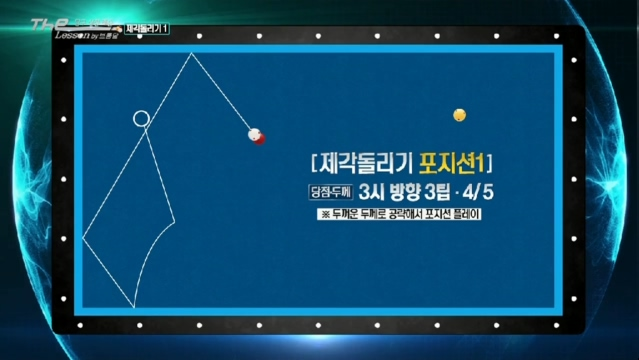

### 제각돌리기2

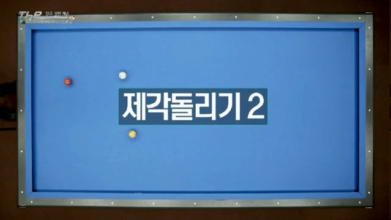

첫번째와 비슷하지만 2적구가 단쿠션이 가깝다.

> 수구의 역회전을 이용해서 해결한다.

**당점 / 두께 / 스트록 : '9시 2팁 / 1/2 / 부드럽게 밀어치기'**

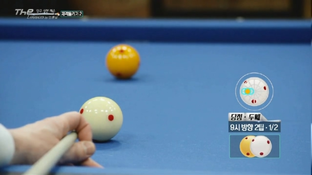

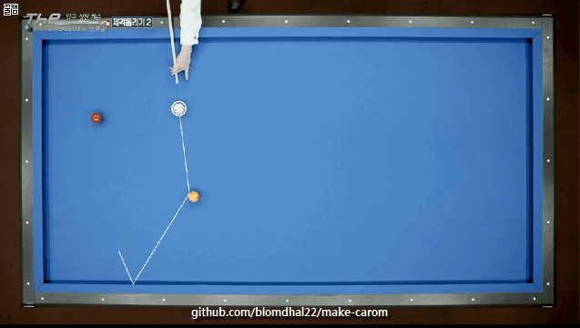

*잘못된 예: 무회전을 이용*

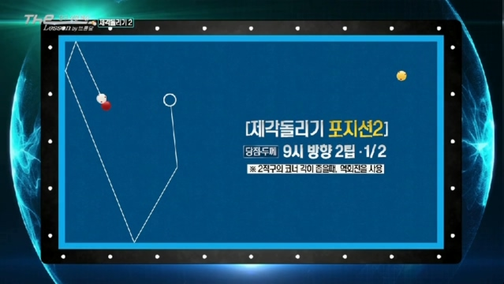

### 제각돌리기3

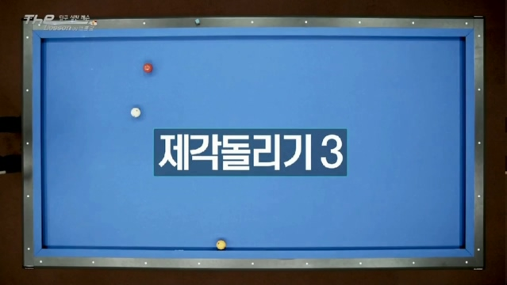

회전을 최대로 주고, 끌어치기에 가까운 공이다.

**당점 / 두께 / 스트록 : '4시 Max / 9/10(almost full ball) / 강하게 팔로우(회전이 유지되어야 한다)'**

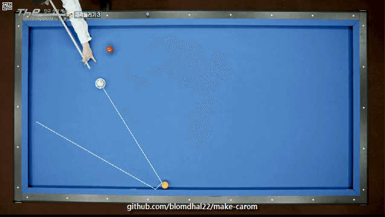

> 회전을 최대치, 강한 스트록이기때문에 어려울 수 있지만, 득점을 할 수 있는 확실한 방법
> 왜냐하면, 두껍게 치는 것은 수구의 회전력을 높여줘서,득점 확률을 높여준다.
> 3쿠션에 회전 마진이 높다.

다른 방법은, 역회전을 이용해서 왼쪽으로 제각돌리기가 있지만, 키스가 확률이 있다.
그래서, 브롬달은 첫번째 방법을 추천한다.

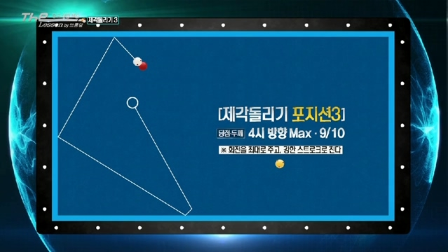

### 제각돌리기4

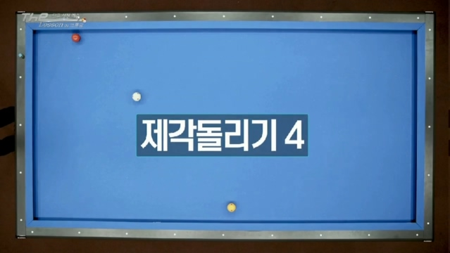

3번째와 매우 비슷하다.
그러나 주의해야할 점 2가지가 있다.

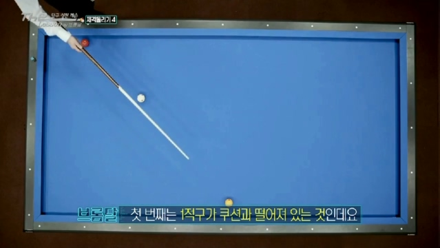

1. 3번째와 같은 스트록으로 친다. 1적구가 쿠션과 떨어져 있는 것에 주목
   쿠션에 붙어 있으면 회전 살리기가 더 쉬웠을 것이다.

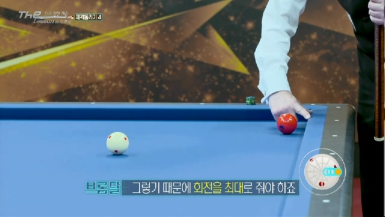

2. 2적구가 쿠션에 가깝게 위치해 있다. -> 그렇기 때문에 회전을 최대로 줘야 한다.
   회전을 최대로 주면, there, there, there, 어디를 맞아도 득점 확률이 높다.

**당점 / 두께 / 스트록 : '3시 Max / 9/10(almost full ball) / 강하게 팔로우(회전이 유지되어야 한다), 두께가 가장 중요'**

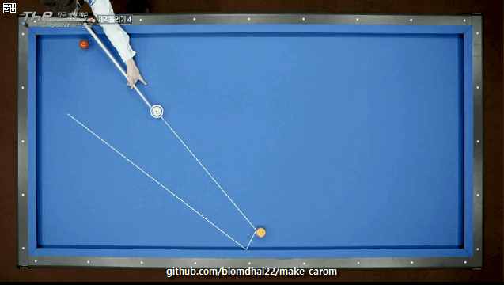

> 수구가 매우 천천히 움직였다. 이것은 마지막 쿠션에서 좀 더 많은 가능성이 생긴다는 뜻이다.

> 이 배치에서 가장 중요한 것은, 1적구를 얼마나 두껍게 맞히느냐이다.

*잘못된 예: 얇게 맞힌 경우*

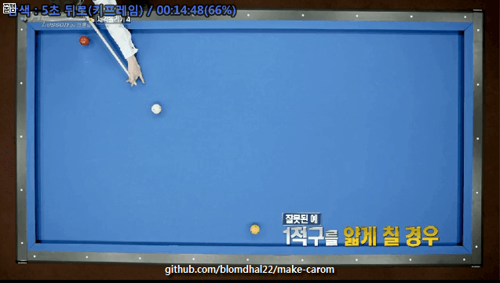

*잘못된 예: 너무 두껍게 맞힌 경우*

> 이 배치에서는 두께가 가장 중요하다.

### 제각돌리기5

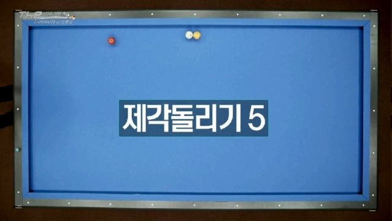

마세이 샷이다.

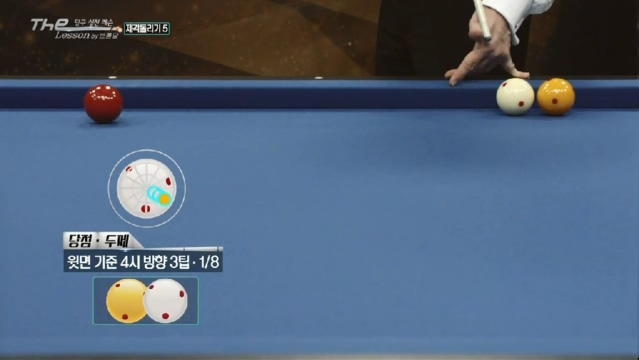

**당점 / 두께 / 스트록 : '윗면 - 4시 3팁 / 1/8 / 가볍게 찍어치기'**

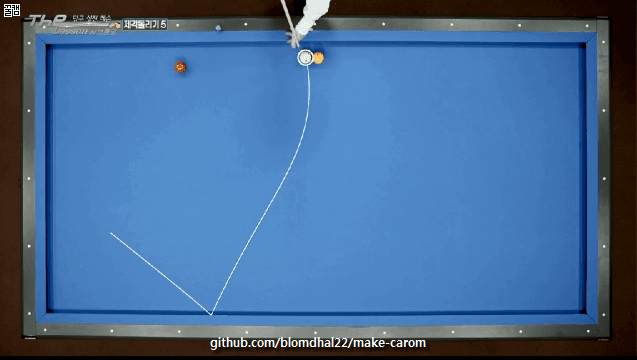

> 포지션 플레이는 의식하지 말고, 득점에만 신경써라.

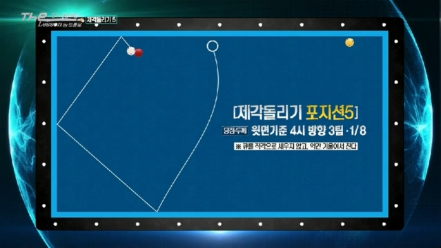

