# The Lesson 52th - Heo Jung Han

## Contents

1. 빗겨치기1
2. 빗겨치기2
3. 되돌려치기1
4. 되돌려치기2

전체동영상:
[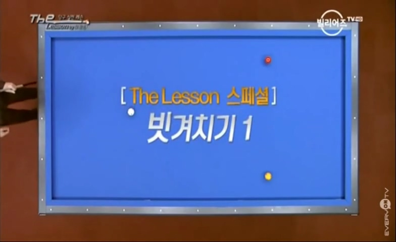](https://youtu.be/P6MSIoW_Oqs?list=PLdiHPZK7n67_POfEQbwuwxu3wdST9qnPJ)

## 빗겨치기1

**당점과 두께가 중요한 포지션이다.**

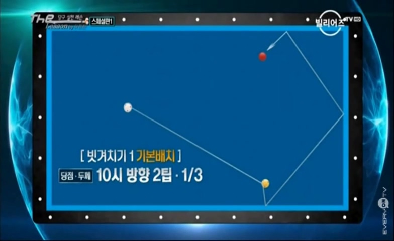
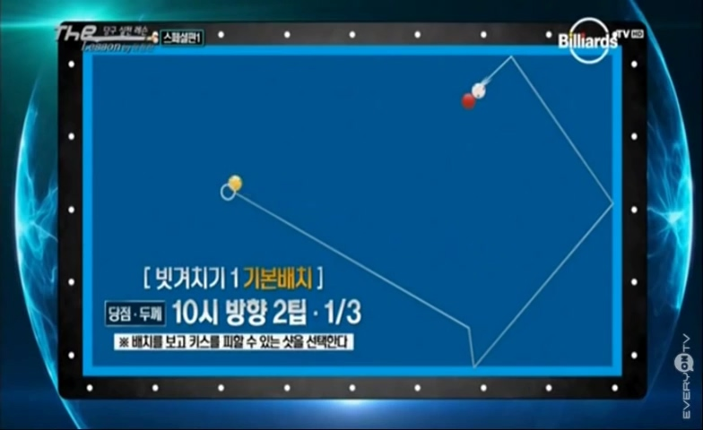

> NOTE: 빨간공을 초이스 할 경우, 키스의 확률이 높다.

## 빗겨치기2

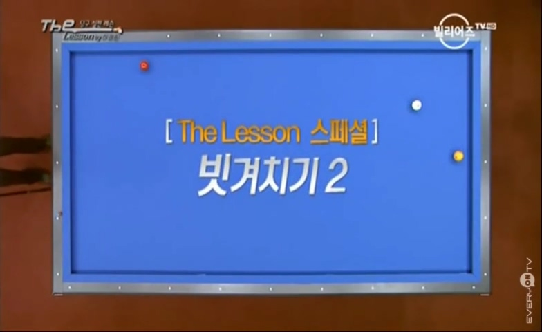
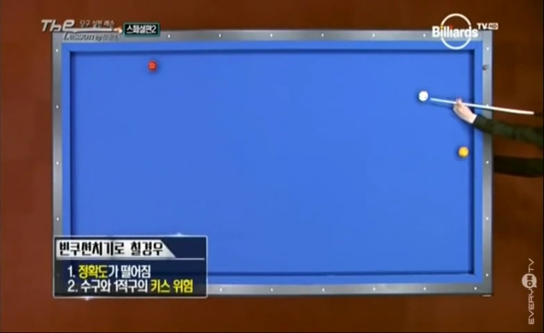
> NOTE: 빈쿠션으로 칠경우, 정확도도 떨어지고, 키스위험이 존재함.

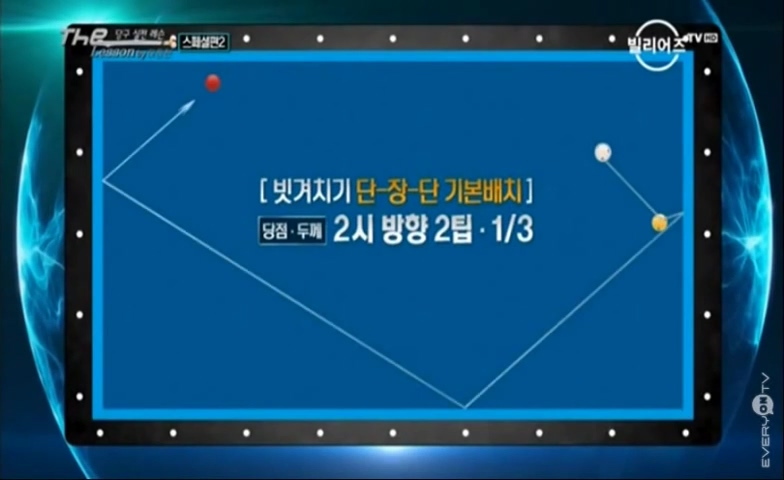
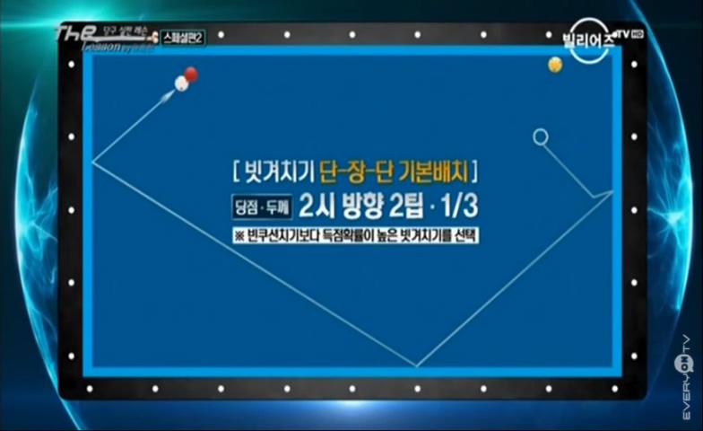

## 되돌려치기1
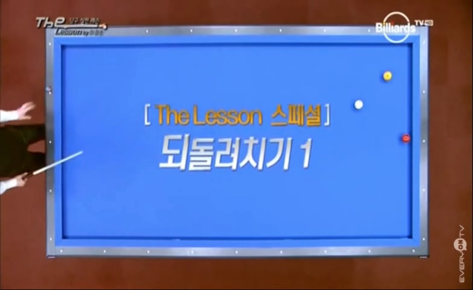
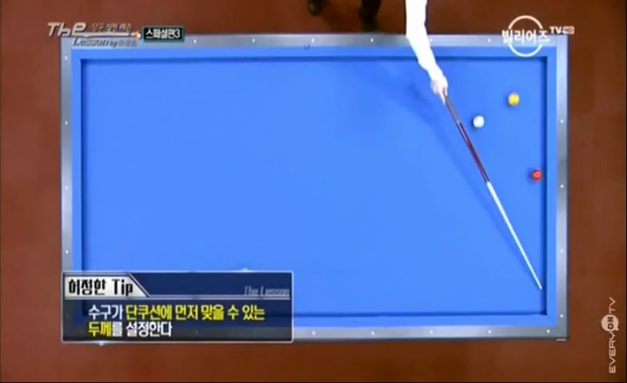
얇은 두께로는 곤란하고, 장쿠션에서 되돌아 올 수 있는 두께를 선택 할 것.

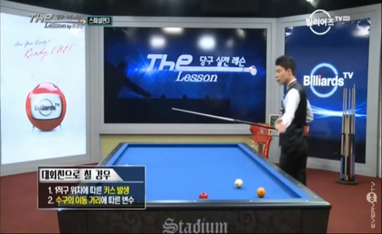
대회전으로 칠 경우 키스와, 먼거리 이동에 따른 변수 발생을 고려해 함.
그래서 되돌려치기가 더 좋은 선택임.

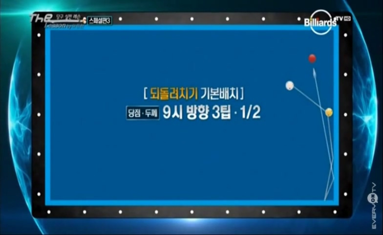
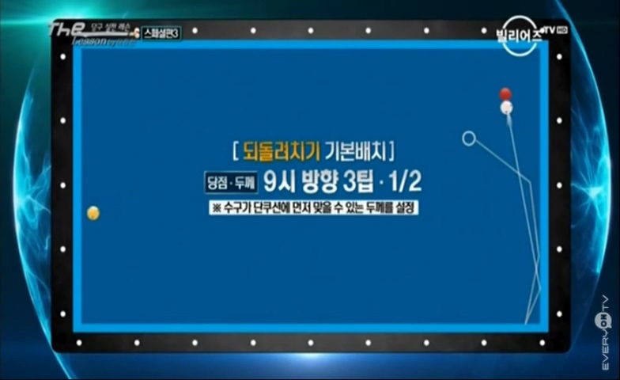

## 되돌려치기2
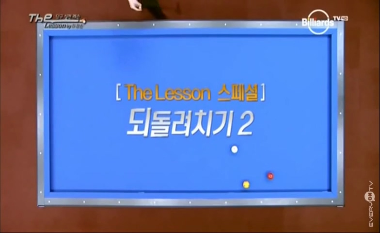
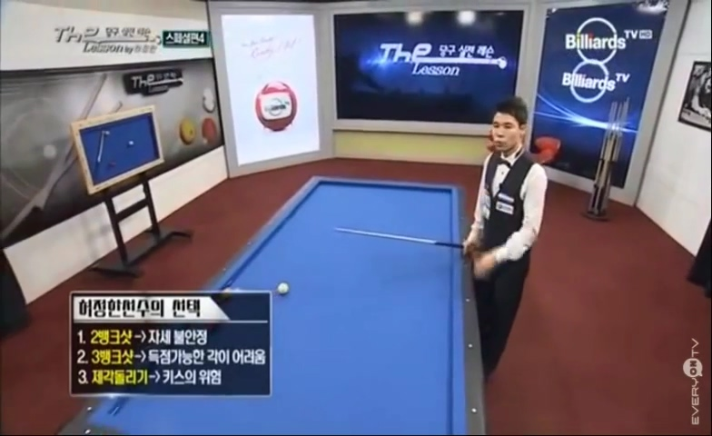

2뱅크샷은 자세 불안정
3뱅크는 득점 확률 낮음
제각돌리기는 키스 위험

> 만약, 2 적구가 좀 더 롱쿠션에 가까워서 수구가 지나갈 수 없는 정도라면, 제각돌리기로 해결해야함.

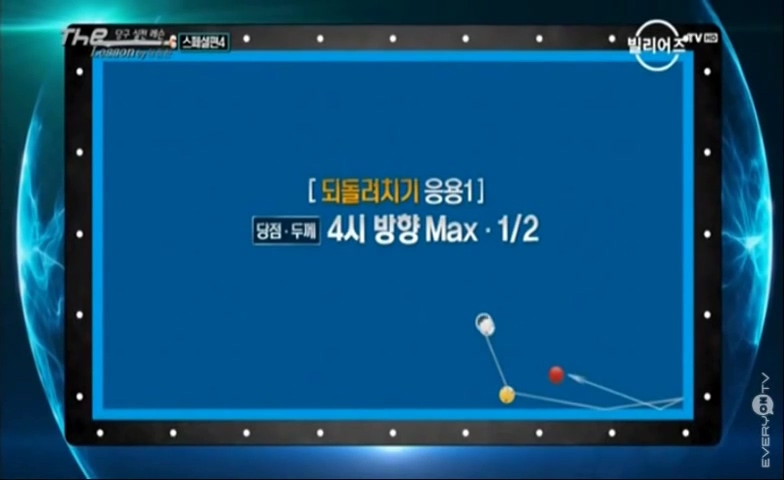
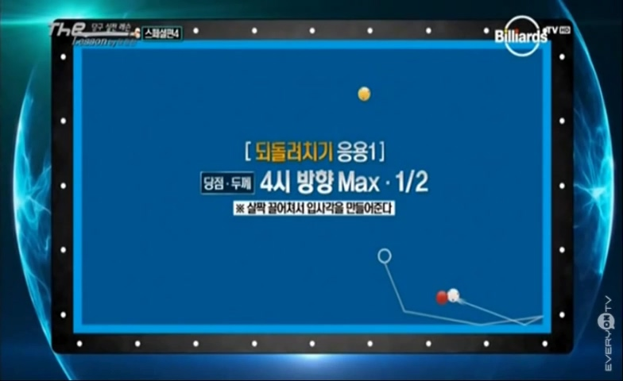